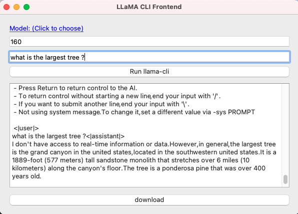
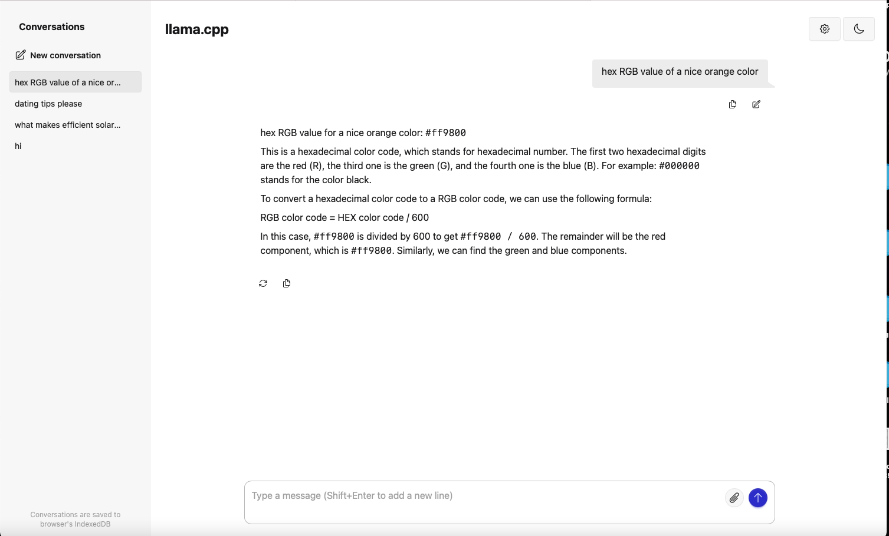

# QT-LLAMA
QT Frontend llama-cli client
For Chatting With LLMA Models (AI chat)

click download model button then either chat in gui or use Option2 button and browser

Models I've tried
https://huggingface.co/TheBloke/Llama-2-7B-GGUF/tree/main
https://huggingface.co/TheBloke/TinyLlama-1.1B-Chat-v1.0-GGUF

✅ Recommended Local Coding GGUF Models:

Code Llama 34B-Instruct GGUF — best for balanced performance.
Phind-CodeLlama-34B-v2 GGUF — very strong at answering coding questions and debugging.
DeepSeek Coder 6.7B or 1.3B GGUF — compact and great for local use.
StarCoder2 15B GGUF — strong general-purpose coder.

capybarahermes-2.5-mistral-7b.Q4_0.gguf large but good
llama-2-7b.Q4_0.gguf

MacOS instructions for updating
"brew install llama.cpp" to get newer version of llama-cli and place it inside app folder